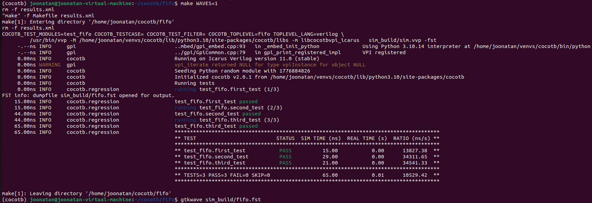
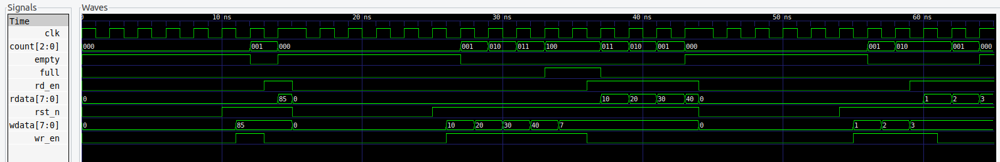

# Blocks

Collection of useful RTL blocks and their TBs.

## Repository structure

Each folder contains RTL, TB and Makefile to run the tests. Finally the waveforms can be checked using GTKWave.

Example of a DUT passing all tests:



Example of waveforms in GTKWave:



## Commands

- Navigate to the right place
- Activate **cocotb**
  
```sh
make                             # Execute the Makefile
make WAVES=1                     # Execute the Makefile and generate waveform data
gtkwave sim_build/fifo.fst       # Open the waveform in GTKWave GUI
```

- Add relevant signals in the GUI and click "Zoom to fit"
